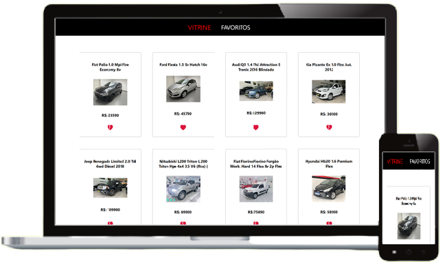

<h1 align="center">
  AUTO SHOPPING
</h1>

  

 

&nbsp;
 &nbsp;
 

 

# 📰 Description / Descrição

🇺🇸 - Showcase of Cars for sale on Mercado Livre, consuming its API.</a>.

 
🇧🇷 - Vitrine de Carros a venda no Mercado Livre, consumindo a API do mesmo.</a>.

 

# 👷🔧 Built With / Construído Com

🇺🇸 - This project was built using these technologies: 
🇧🇷 - Este Projeto foi construído utilizando essas tecnologias:

- ReactJS

 

# ✨ Features / Recursos
## 🇺🇸
- ⚙️ API consumption;
- 💔 Functionality to Add/Remove from Favorites list and stored in localStorage;
- 🛒 Button to direct to real ad;

## 🇧🇷
- ⚙️ Consumo de API;
- 💔 Funcionalidade de Adicionar/Remover da lista de Favoritos e armazenado no localStorage;
- 🛒 Botão para direcionar ao anúncio real;
 
 

# 🛠 Setup Instructions / Orientações para Executar

- Download the project [HERE](https://github.com/jvasques/autoShopping/archive/refs/heads/main.zip)

- Unzip the file

- Install project dependencies: `npm install` or `yarn install`

- In the project directory, you can run: `npm start` or `yarn start`

Open [http://localhost:3000](http://localhost:3000) to view it in the browser.
The page will reload if you make edits.

# 

